# OpenGL 渲染框架项目文档

## 📁 项目结构

```
11_MainOpenGL/
├── 📄 CMakeLists.txt          # CMake 构建配置 (支持PC/Android)
├── 📄 main.cpp                # PC端应用程序入口 (Application类)
├── 📄 native_renderer.cpp     # Android JNI入口 (EGL管理)
├── 📄 compile_so.bat          # Android .so编译脚本
├── 📂 Component/              # 核心组件目录
│   ├── 📄 irenderer.hpp       # 渲染器接口定义
│   ├── 📄 render_config.hpp   # 渲染配置类 (含嵌入式shader)
│   ├── 📄 render_context.hpp  # 渲染上下文类
│   ├── 📄 render_factory.hpp  # 渲染器工厂
│   ├── 📄 shader.hpp/cpp      # Shader管理类
│   └── 📄 triangle_render.hpp/cpp  # 三角形渲染器实现
├── 📂 shaders/                # 着色器文件目录
│   ├── 📄 Convert_GLSL_to_h.py    # GLSL转头文件工具
│   ├── 📄 triangle.vert.glsl      # 顶点着色器源码
│   ├── 📄 triangle.frag.glsl      # 片段着色器源码
│   ├── 📄 triangle.vert.core.h    # PC版顶点着色器 (#version 330 core)
│   ├── 📄 triangle.frag.core.h    # PC版片段着色器
│   ├── 📄 triangle.vert.es.h      # Android版顶点着色器 (#version 310 es)
│   └── 📄 triangle.frag.es.h      # Android版片段着色器
├── 📂 example/                # 示例项目
│   └── 📂 android/            # Android示例工程
│       └── 📂 app/src/main/
│           ├── 📂 java/.../androidopengles/
│           │   ├── 📄 MainActivity.kt      # Android主Activity
│           │   ├── 📄 NativeRenderer.kt    # JNI桥接类
│           │   └── 📄 OpenGLSurfaceView.kt # OpenGL渲染视图
│           └── 📂 jniLibs/arm64-v8a/
│               └── 📄 libmain_opengl.so    # 编译后的Native库
├── 📂 3rdparty/               # 第三方库
│   ├── 📂 glad/               # OpenGL加载器 (仅PC)
│   ├── 📂 glfw/               # 窗口管理库 (仅PC)
│   └── 📂 glm/                # 数学库 (跨平台)
└── 📂 docs/                   # 文档目录
```

---

## 🌐 跨平台架构

### PC vs Android 对比

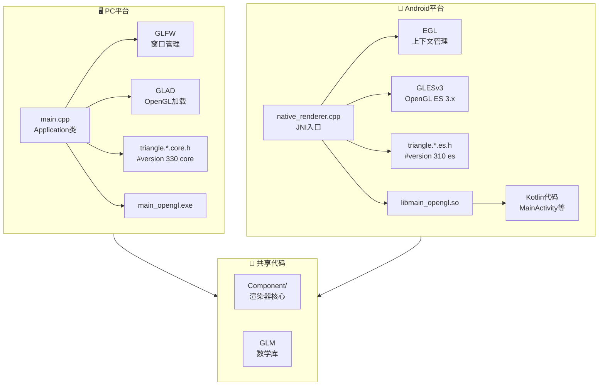

### 条件编译机制

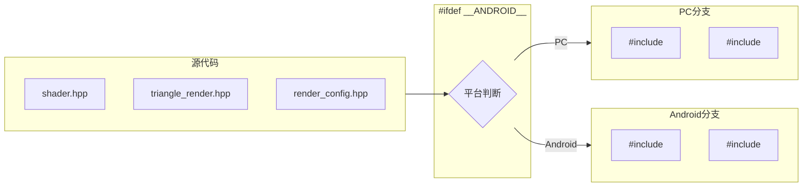

---

## 🏗️ 架构设计

### 整体架构图

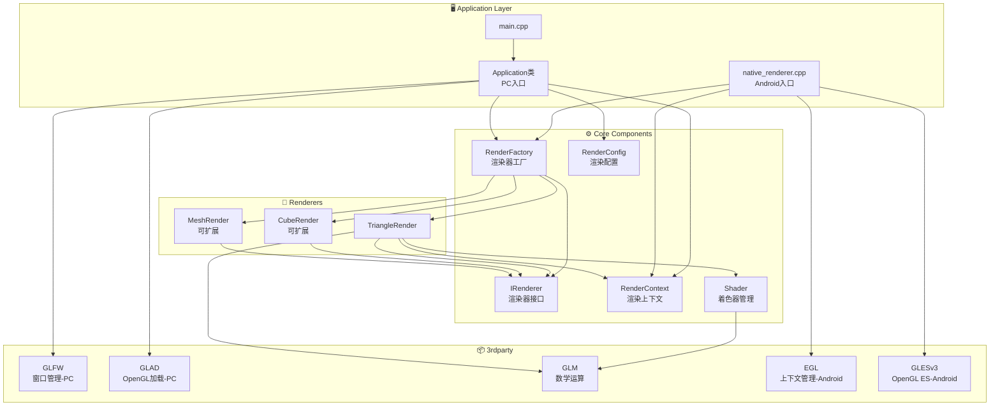

### 类关系图


---

## 📱 Android JNI 架构

### JNI调用流程

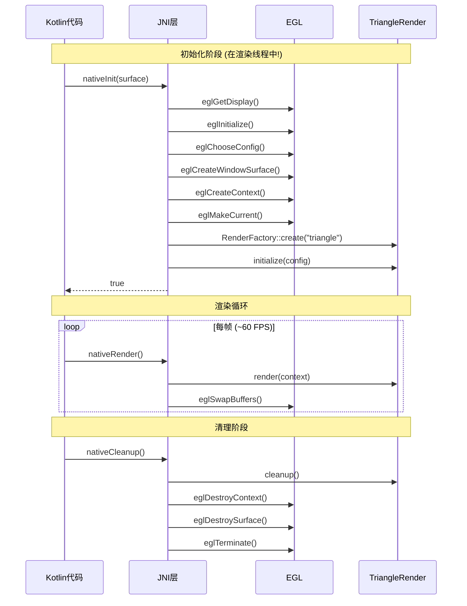

### Android线程模型

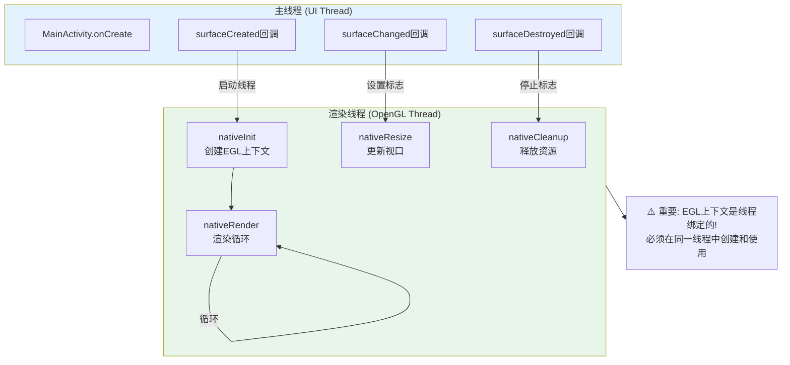

---

## 🔄 渲染流程

### 初始化流程

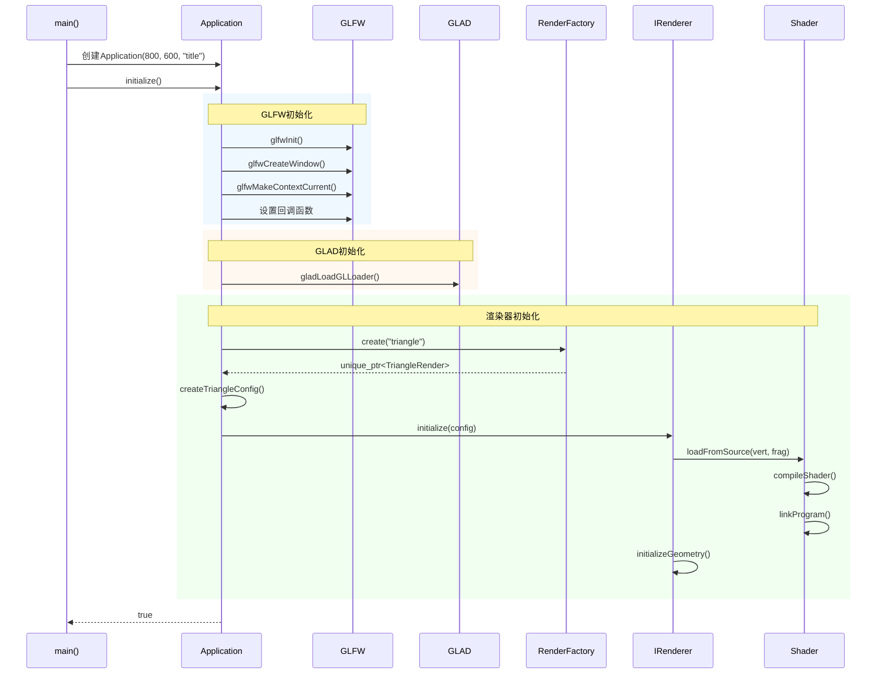

### 渲染循环流程


---

## 🛠️ 构建系统

### Shader编译流程

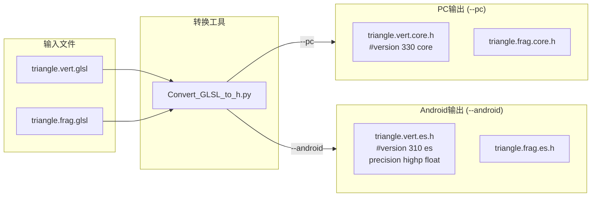

### Android编译流程 (compile_so.bat)

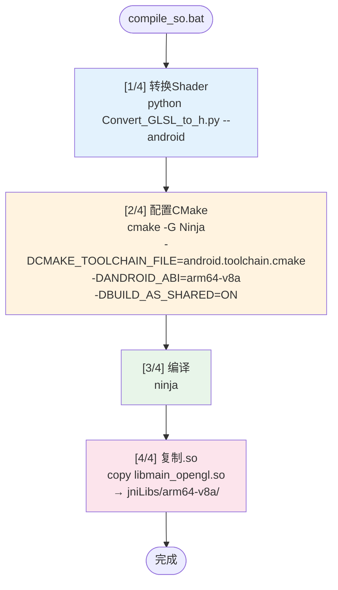

### CMakeLists.txt 条件编译

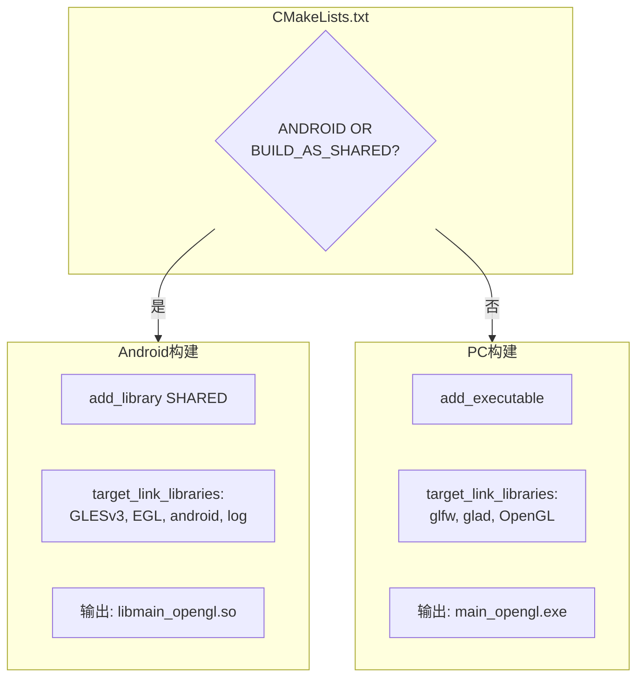

---

## 🆕 创建新渲染器指南

### 步骤概览

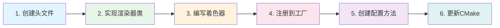

### 详细步骤

#### 步骤 1: 创建渲染器头文件

在 `Component/` 目录下创建新文件，例如 `cube_render.hpp`:

```cpp
#pragma once
#include "irenderer.hpp"
#include "render_config.hpp"
#include "render_context.hpp"
#include "shader.hpp"

// 跨平台OpenGL头文件
#ifdef __ANDROID__
    #include <GLES3/gl3.h>
#else
    #include <glad/glad.h>
#endif

#include <glm/glm.hpp>

class CubeRender : public IRenderer {
public:
    CubeRender();
    ~CubeRender() override;

    // 实现IRenderer接口
    bool initialize(const RenderConfig& config) override;
    bool render(const RenderContext& context) override;
    bool resize(int width, int height) override;
    void cleanup() override;
    void setErrorCallback(ErrorCallback callback) override;
    std::string getName() const override { return "CubeRender"; }

private:
    bool initializeGeometry(const std::vector<VertexData>& vertices);
    void reportError(RenderError error, const std::string& message);

    Shader m_shader;
    GLuint m_vao;
    GLuint m_vbo;
    GLuint m_ebo;  // 索引缓冲
    glm::mat4 m_projection;
    glm::vec4 m_clearColor;
    
    ErrorCallback m_errorCallback;
    bool m_initialized;
};
```

#### 步骤 2: 实现渲染器

创建 `cube_render.cpp`:

```cpp
#include "cube_render.hpp"
#include <iostream>

CubeRender::CubeRender()
    : m_vao(0), m_vbo(0), m_ebo(0), m_initialized(false) {}

CubeRender::~CubeRender() { cleanup(); }

bool CubeRender::initialize(const RenderConfig& config) {
    // 1. 从源码加载着色器（编译时嵌入）
    if (!m_shader.loadFromSource(config.vertexShaderSource(), 
                                  config.fragmentShaderSource())) {
        reportError(RenderError::ShaderCompilationFailed, 
                   m_shader.lastError());
        return false;
    }

    // 2. 初始化几何体
    if (!initializeGeometry(config.vertexData())) {
        reportError(RenderError::BufferCreationFailed, 
                   "Failed to create buffers");
        return false;
    }

    m_clearColor = config.clearColor();
    m_initialized = true;
    return true;
}

bool CubeRender::render(const RenderContext& context) {
    if (!m_initialized) return false;

    glClearColor(m_clearColor.x, m_clearColor.y, 
                 m_clearColor.z, m_clearColor.w);
    glClear(GL_COLOR_BUFFER_BIT | GL_DEPTH_BUFFER_BIT);

    // 计算MVP矩阵
    glm::mat4 model = glm::mat4(1.0f);
    // ... 添加变换 ...
    glm::mat4 mvp = context.projectionMatrix() * model;

    // 渲染
    m_shader.use();
    m_shader.setMat4("mvp", mvp);
    
    glBindVertexArray(m_vao);
    glDrawElements(GL_TRIANGLES, 36, GL_UNSIGNED_INT, 0);
    glBindVertexArray(0);

    return true;
}

// ... 其他方法实现 ...
```

#### 步骤 3: 编写着色器

在 `shaders/` 目录下创建着色器文件，然后使用转换工具:

**cube.vert.glsl:**
```glsl
#version 330 core
layout(location = 0) in vec3 position;
layout(location = 1) in vec3 color;

out vec3 fragColor;
uniform mat4 mvp;

void main() {
    gl_Position = mvp * vec4(position, 1.0);
    fragColor = color;
}
```

**生成头文件:**
```bash
# PC版本
python shaders/Convert_GLSL_to_h.py shaders/cube.vert.glsl shaders/cube.vert.core.h --pc

# Android版本
python shaders/Convert_GLSL_to_h.py shaders/cube.vert.glsl shaders/cube.vert.es.h --android
```

#### 步骤 4: 注册到工厂

修改 `render_factory.hpp`:

```cpp
#pragma once
#include "irenderer.hpp"
#include "triangle_render.hpp"
#include "cube_render.hpp"  // 添加新渲染器头文件
#include <memory>

enum class RenderType {
    Triangle,
    Cube,      // 添加新类型
    Custom,
};

class RenderFactory {
public:
    static std::unique_ptr<IRenderer> create(RenderType type) {
        switch (type) {
        case RenderType::Triangle:
            return std::make_unique<TriangleRender>();
        case RenderType::Cube:                              // 新增
            return std::make_unique<CubeRender>();          // 新增
        default:
            return nullptr;
        }
    }

    static std::unique_ptr<IRenderer> create(const std::string& typeName) {
        if (typeName == "triangle") {
            return create(RenderType::Triangle);
        } else if (typeName == "cube") {                    // 新增
            return create(RenderType::Cube);                // 新增
        }
        return nullptr;
    }
};
```

#### 步骤 5: 添加配置方法

在 `render_config.hpp` 中添加:

```cpp
// 在头文件顶部添加条件包含
#ifdef __ANDROID__
    #include <cube.vert.es.h>
    #include <cube.frag.es.h>
#else
    #include <cube.vert.core.h>
    #include <cube.frag.core.h>
#endif

// 添加配置方法
static RenderConfig createCubeConfig() {
    RenderConfig config;
    
    // 使用编译时嵌入的着色器
    config.setVertexShaderSource(CUBE_VERTEX_SHADER)
          .setFragmentShaderSource(CUBE_FRAGMENT_SHADER);
    
    // 设置立方体顶点数据
    std::vector<VertexData> vertices = {
        // ... 立方体顶点 ...
    };
    
    config.setVertexData(vertices)
          .setClearColor(0.1f, 0.1f, 0.2f, 1.0f);
    
    return config;
}
```

#### 步骤 6: 更新CMakeLists.txt

```cmake
set(COMPONENT_SOURCES
    Component/triangle_render.cpp
    Component/cube_render.cpp      # 添加新文件
    Component/shader.cpp
)

set(COMPONENT_HEADERS
    Component/irenderer.hpp
    Component/render_config.hpp
    Component/render_context.hpp
    Component/render_factory.hpp
    Component/triangle_render.hpp
    Component/cube_render.hpp      # 添加新文件
    Component/shader.hpp
)
```

---

## 🎯 设计模式说明

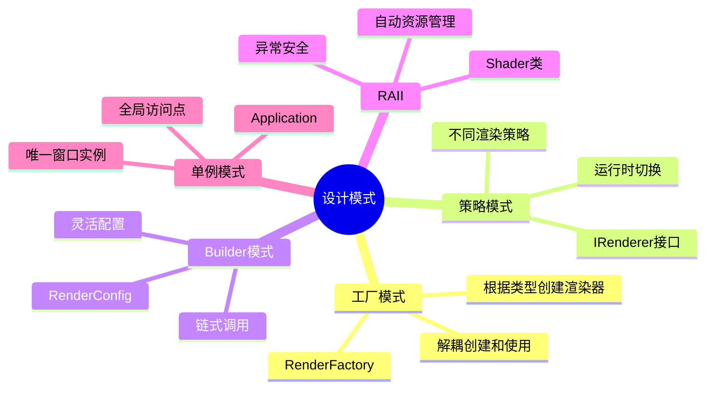

---

## 📝 关键代码示例

### 使用新渲染器

```cpp
// 在Application中切换渲染器
bool Application::initializeRenderer() {
    // 方式1: 使用字符串
    m_renderer = RenderFactory::create("cube");
    
    // 方式2: 使用枚举
    m_renderer = RenderFactory::create(RenderType::Cube);
    
    // 使用对应配置
    m_config = RenderConfig::createCubeConfig();
    
    return m_renderer->initialize(m_config);
}
```

### Shader类使用示例

```cpp
Shader shader;

// 从源码加载（推荐 - 编译时嵌入）
if (shader.loadFromSource(VERTEX_SHADER_SOURCE, FRAGMENT_SHADER_SOURCE)) {
    shader.use();
    
    // 设置uniform变量
    shader.setMat4("mvp", mvpMatrix);
    shader.setVec3("lightPos", glm::vec3(1.0f, 1.0f, 1.0f));
    shader.setFloat("time", currentTime);
    
    // 渲染...
    
    shader.unuse();
}

// 或从文件加载（仅PC调试用）
shader.loadFromFile("vertex.glsl", "fragment.glsl");
```

---

## 🔧 扩展建议

1. **添加纹理支持**: 创建Texture类管理纹理加载
2. **添加模型加载**: 集成Assimp库加载3D模型
3. **添加光照系统**: 实现Phong/PBR光照
4. **添加相机系统**: 创建Camera类管理视图变换
5. **添加ImGui**: 集成调试界面
6. **多ABI支持**: 添加armeabi-v7a, x86_64等架构

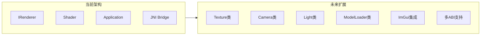

---

## ⚠️ 注意事项

### Android开发关键点

1. **EGL上下文线程绑定**: EGL上下文只能在创建它的线程中使用，必须确保`nativeInit()`、`nativeRender()`、`nativeCleanup()`在同一线程调用

2. **Shader版本差异**: 
   - PC: `#version 330 core`
   - Android: `#version 310 es` + `precision highp float;`

3. **库命名**: .so文件必须以`lib`开头，加载时去掉前缀
   - 文件名: `libmain_opengl.so`
   - 加载: `System.loadLibrary("main_opengl")`

4. **JNI函数命名**: 必须严格匹配包名
   - 格式: `Java_包名_类名_方法名`
   - 示例: `Java_com_example_androidopengles_NativeRenderer_nativeInit`
