# OpenGL 渲染框架项目文档

## 📁 项目结构

```
11_MainOpenGL/
├── 📄 CMakeLists.txt          # CMake 构建配置
├── 📄 main.cpp                # 应用程序入口 (Application类)
├── 📂 Component/              # 核心组件目录
│   ├── 📄 irenderer.hpp       # 渲染器接口定义
│   ├── 📄 render_config.hpp   # 渲染配置类
│   ├── 📄 render_context.hpp  # 渲染上下文类
│   ├── 📄 render_factory.hpp  # 渲染器工厂
│   ├── 📄 shader.hpp/cpp      # Shader管理类
│   └── 📄 triangle_render.hpp/cpp  # 三角形渲染器实现
├── 📂 shaders/                # 着色器文件目录
│   ├── 📄 triangle.vert.glsl  # 顶点着色器
│   └── 📄 triangle.frag.glsl  # 片段着色器
├── 📂 3rdparty/               # 第三方库
│   ├── 📂 glad/               # OpenGL加载器
│   ├── 📂 glfw/               # 窗口管理库
│   └── 📂 glm/                # 数学库
└── 📂 docs/                   # 文档目录
```

---

## 🏗️ 架构设计

### 整体架构图

```mermaid
graph TB
    subgraph Application["🖥️ Application Layer"]
        APP[Application类]
        MAIN[main.cpp]
    end
    
    subgraph Core["⚙️ Core Components"]
        IR[IRenderer<br/>渲染器接口]
        RF[RenderFactory<br/>渲染器工厂]
        RC[RenderConfig<br/>渲染配置]
        RX[RenderContext<br/>渲染上下文]
        SH[Shader<br/>着色器管理]
    end
    
    subgraph Renderers["🎨 Renderers"]
        TR[TriangleRender]
        CR[CubeRender<br/>可扩展]
        MR[MeshRender<br/>可扩展]
    end
    
    subgraph External["📦 3rdparty"]
        GLFW[GLFW<br/>窗口管理]
        GLAD[GLAD<br/>OpenGL加载]
        GLM[GLM<br/>数学运算]
    end
    
    MAIN --> APP
    APP --> RF
    APP --> RC
    RF --> IR
    RF --> TR
    RF --> CR
    RF --> MR
    TR --> SH
    TR --> IR
    CR --> IR
    MR --> IR
    APP --> RX
    TR --> RX
    APP --> GLFW
    APP --> GLAD
    SH --> GLM
    TR --> GLM
```



### 类关系图


---

## 🔄 渲染流程

### 初始化流程


### 渲染循环流程


---

## 🆕 创建新渲染器指南

### 步骤概览

```mermaid
flowchart LR
    A[1. 创建头文件] --> B[2. 实现渲染器类]
    B --> C[3. 编写着色器]
    C --> D[4. 注册到工厂]
    D --> E[5. 创建配置方法]
    E --> F[6. 更新CMake]
    
    style A fill:#e1f5fe
    style B fill:#e8f5e9
    style C fill:#fff3e0
    style D fill:#fce4ec
    style E fill:#f3e5f5
    style F fill:#e0f2f1
```



### 详细步骤

#### 步骤 1: 创建渲染器头文件

在 `Component/` 目录下创建新文件，例如 `cube_render.hpp`:

```cpp
#pragma once
#include "irenderer.hpp"
#include "render_config.hpp"
#include "render_context.hpp"
#include "shader.hpp"

#include <glad/glad.h>
#include <glm/glm.hpp>

class CubeRender : public IRenderer {
public:
    CubeRender();
    ~CubeRender() override;

    // 实现IRenderer接口
    bool initialize(const RenderConfig& config) override;
    bool render(const RenderContext& context) override;
    bool resize(int width, int height) override;
    void cleanup() override;
    void setErrorCallback(ErrorCallback callback) override;
    std::string getName() const override { return "CubeRender"; }

private:
    bool initializeGeometry(const std::vector<VertexData>& vertices);
    void reportError(RenderError error, const std::string& message);

    Shader m_shader;
    GLuint m_vao;
    GLuint m_vbo;
    GLuint m_ebo;  // 索引缓冲
    glm::mat4 m_projection;
    glm::vec4 m_clearColor;
    
    ErrorCallback m_errorCallback;
    bool m_initialized;
};
```

#### 步骤 2: 实现渲染器

创建 `cube_render.cpp`:

```cpp
#include "cube_render.hpp"
#include <iostream>

CubeRender::CubeRender()
    : m_vao(0), m_vbo(0), m_ebo(0), m_initialized(false) {}

CubeRender::~CubeRender() { cleanup(); }

bool CubeRender::initialize(const RenderConfig& config) {
    // 1. 加载着色器
    if (!m_shader.loadFromFile(config.vertexShaderPath(), 
                                config.fragmentShaderPath())) {
        reportError(RenderError::ShaderCompilationFailed, 
                   m_shader.lastError());
        return false;
    }

    // 2. 初始化几何体
    if (!initializeGeometry(config.vertexData())) {
        reportError(RenderError::BufferCreationFailed, 
                   "Failed to create buffers");
        return false;
    }

    m_clearColor = config.clearColor();
    m_initialized = true;
    return true;
}

bool CubeRender::render(const RenderContext& context) {
    if (!m_initialized) return false;

    glClearColor(m_clearColor.x, m_clearColor.y, 
                 m_clearColor.z, m_clearColor.w);
    glClear(GL_COLOR_BUFFER_BIT | GL_DEPTH_BUFFER_BIT);

    // 计算MVP矩阵
    glm::mat4 model = glm::mat4(1.0f);
    // ... 添加变换 ...
    glm::mat4 mvp = context.projectionMatrix() * model;

    // 渲染
    m_shader.use();
    m_shader.setMat4("mvp", mvp);
    
    glBindVertexArray(m_vao);
    glDrawElements(GL_TRIANGLES, 36, GL_UNSIGNED_INT, 0);
    glBindVertexArray(0);

    return true;
}

// ... 其他方法实现 ...
```

#### 步骤 3: 编写着色器

在 `shaders/` 目录下创建着色器文件:

**cube.vert.glsl:**
```glsl
#version 330 core
layout(location = 0) in vec3 position;
layout(location = 1) in vec3 color;

out vec3 fragColor;
uniform mat4 mvp;

void main() {
    gl_Position = mvp * vec4(position, 1.0);
    fragColor = color;
}
```

**cube.frag.glsl:**
```glsl
#version 330 core
in vec3 fragColor;
out vec4 finalColor;

void main() {
    finalColor = vec4(fragColor, 1.0);
}
```

#### 步骤 4: 注册到工厂

修改 `render_factory.hpp`:

```cpp
#pragma once
#include "irenderer.hpp"
#include "triangle_render.hpp"
#include "cube_render.hpp"  // 添加新渲染器头文件
#include <memory>

enum class RenderType {
    Triangle,
    Cube,      // 添加新类型
    Custom,
};

class RenderFactory {
public:
    static std::unique_ptr<IRenderer> create(RenderType type) {
        switch (type) {
        case RenderType::Triangle:
            return std::make_unique<TriangleRender>();
        case RenderType::Cube:                              // 新增
            return std::make_unique<CubeRender>();          // 新增
        default:
            return nullptr;
        }
    }

    static std::unique_ptr<IRenderer> create(const std::string& typeName) {
        if (typeName == "triangle") {
            return create(RenderType::Triangle);
        } else if (typeName == "cube") {                    // 新增
            return create(RenderType::Cube);                // 新增
        }
        return nullptr;
    }
};
```

#### 步骤 5: 添加配置方法

在 `render_config.hpp` 中添加:

```cpp
static RenderConfig createCubeConfig() {
    RenderConfig config;
    config.setVertexShaderPath("shaders/cube.vert.glsl")
          .setFragmentShaderPath("shaders/cube.frag.glsl");
    
    // 设置立方体顶点数据
    std::vector<VertexData> vertices = {
        // ... 立方体顶点 ...
    };
    
    config.setVertexData(vertices)
          .setClearColor(0.1f, 0.1f, 0.2f, 1.0f);
    
    return config;
}
```

#### 步骤 6: 更新CMakeLists.txt

```cmake
set(COMPONENT_SOURCES
    Component/triangle_render.cpp
    Component/cube_render.cpp      # 添加新文件
    Component/shader.cpp
)

set(COMPONENT_HEADERS
    Component/irenderer.hpp
    Component/render_config.hpp
    Component/render_context.hpp
    Component/render_factory.hpp
    Component/triangle_render.hpp
    Component/cube_render.hpp      # 添加新文件
    Component/shader.hpp
)
```

---

## 🎯 设计模式说明

```mermaid
mindmap
  root((设计模式))
    工厂模式
      RenderFactory
      根据类型创建渲染器
      解耦创建和使用
    策略模式
      IRenderer接口
      不同渲染策略
      运行时切换
    Builder模式
      RenderConfig
      链式调用
      灵活配置
    RAII
      Shader类
      自动资源管理
      异常安全
    单例模式
      Application
      唯一窗口实例
      全局访问点
```



---

## 📝 关键代码示例

### 使用新渲染器

```cpp
// 在Application中切换渲染器
bool Application::initializeRenderer() {
    // 方式1: 使用字符串
    m_renderer = RenderFactory::create("cube");
    
    // 方式2: 使用枚举
    m_renderer = RenderFactory::create(RenderType::Cube);
    
    // 使用对应配置
    m_config = RenderConfig::createCubeConfig();
    
    return m_renderer->initialize(m_config);
}
```

### Shader类使用示例

```cpp
Shader shader;

// 从文件加载
if (shader.loadFromFile("vertex.glsl", "fragment.glsl")) {
    shader.use();
    
    // 设置uniform变量
    shader.setMat4("mvp", mvpMatrix);
    shader.setVec3("lightPos", glm::vec3(1.0f, 1.0f, 1.0f));
    shader.setFloat("time", currentTime);
    
    // 渲染...
    
    shader.unuse();
}
```

---

## 🔧 扩展建议

1. **添加纹理支持**: 创建Texture类管理纹理加载
2. **添加模型加载**: 集成Assimp库加载3D模型
3. **添加光照系统**: 实现Phong/PBR光照
4. **添加相机系统**: 创建Camera类管理视图变换
5. **添加ImGui**: 集成调试界面

```mermaid
graph LR
    subgraph Future["未来扩展"]
        TEX[Texture类]
        CAM[Camera类]
        LIGHT[Light类]
        MODEL[ModelLoader类]
        UI[ImGui集成]
    end
    
    subgraph Current["当前架构"]
        IR[IRenderer]
        SH[Shader]
        APP[Application]
    end
    
    Current --> Future
```


